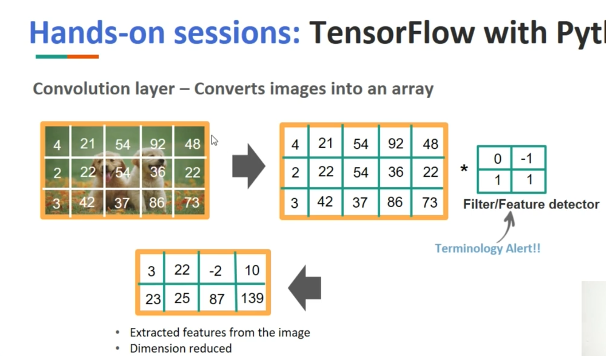
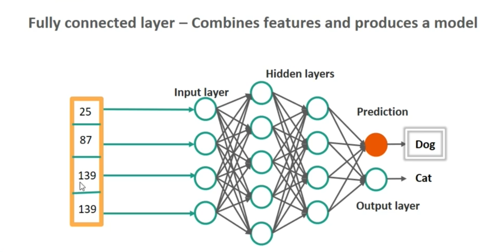

This is a pretty long video - 39 minutes!

Convolutional Neural Network: Popular for classifying images

- Convolution layer - converts images into an array
- Filter layer - reduces size of the image data
- ReLu (Rectified Linear Unit) layer - regularization used to convert negative numbers to zero
- Pooling layer - used for reducing the input image size with filters
- Fully connected layer - Combines features and produces a model

ReLu:
 - Technically, a half rectifier (think electronics)
 - Purpose is to eliminate negative numbers:  f(x) = max(0, x)
 - But what if we have lots of negative numbers?
 - Leaky ReLU: f(x) = max(0.01x, x)  Instead of clamping at zero, scale negative numbers
A cheap substitute for the sigmoid function. Solves a lot of issues!

Convolution Layer:

- The Filter layer runs across all the image and
- The ReLU layer then eliminates negative values
- Pooling layer reduces the image size commonly 2x2 filter. Prevents overfitting
- Fully connected layer - combine the features and produce a model.

(Workshop with jupyter notebook example starts at 17:12)

Cat & Dog images.